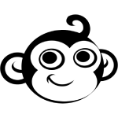

<p align="center">
    <a href="#">
        
    </a>
</p>
<p align="center">
    <a href="LICENSE">
        
    </a>
    <a href="#">
        
    </a>
    <a href="https://github.com/tengames/wheel-of-fortune/issues">
        
    </a>
    <a href="CONTRIBUTING.md">
        
    </a>
</p>

# Wheel of Fortune
The simulation game for the TV game show Wheel of Fortune.

## Features

## First glimpse

## Wiki
The [wiki](https://github.com/tengames/wheel-of-fortune/wiki) provides implementation level details and answers to general questions that a developer starting to use this project might have about it.

## Dependencies

## Requirements
- Java 1.6

## License
This project is currently available under the [MIT](LICENSE) License.

## Contributing
Please check out the [contributing guideline](CONTRIBUTING.md) for more details.

## Installation
You can get the sources
```sh
$ git clone https://github.com/tengames/wheel-of-fortune.git
```

<style>.bmc-button img{height: 34px !important;width: 35px !important;margin-bottom: 1px !important;box-shadow: none !important;border: none !important;vertical-align: middle !important;}.bmc-button{padding: 7px 15px 7px 10px !important;line-height: 35px !important;height:51px !important;text-decoration: none !important;display:inline-flex !important;color:#FFFFFF !important;background-color:#FF813F !important;border-radius: 5px !important;border: 1px solid transparent !important;padding: 7px 15px 7px 10px !important;font-size: 22px !important;letter-spacing: 0.6px !important;box-shadow: 0px 1px 2px rgba(190, 190, 190, 0.5) !important;-webkit-box-shadow: 0px 1px 2px 2px rgba(190, 190, 190, 0.5) !important;margin: 0 auto !important;font-family:'Cookie', cursive !important;-webkit-box-sizing: border-box !important;box-sizing: border-box !important;}.bmc-button:hover, .bmc-button:active, .bmc-button:focus {-webkit-box-shadow: 0px 1px 2px 2px rgba(190, 190, 190, 0.5) !important;text-decoration: none !important;box-shadow: 0px 1px 2px 2px rgba(190, 190, 190, 0.5) !important;opacity: 0.85 !important;color:#FFFFFF !important;}</style><link href="https://fonts.googleapis.com/css?family=Cookie" rel="stylesheet"><a class="bmc-button" target="_blank" href="https://www.buymeacoffee.com/congcoi123"><span style="margin-left:5px;font-size:28px !important;">Buy me a coffee</span></a>

> Happy coding !
